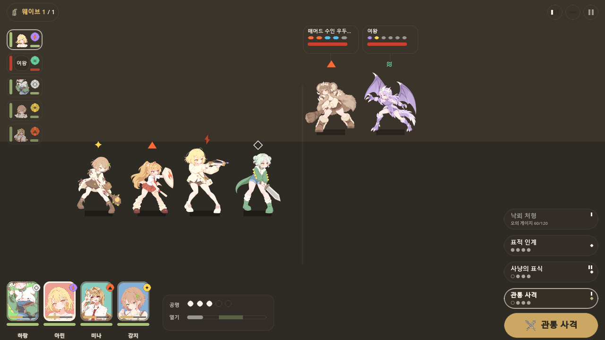

# 최종 검수 · 전투 애니메이션 #491

검수일: 2026-09-12. Godot 4.6.3, Windows, 실제 화면은 OpenGL Compatibility / 1280×720으로 확인했다.

## 납품 구성

12체 × 14컷 = **168개의 투명 PNG**, **12개 SpriteFrames**가 캐릭터·적 데이터의 battle_frames에 연결됐다. 원본 idle_0 12컷은 기존 PNG와 SHA-256이 같고, 새 컷 156장은 이미지 생성으로 제작했다. 소스 원본과 프롬프트, 3컷의 후속 수정 프롬프트를 함께 보관한다.

[프레임별 파일·크기·SHA-256 목록](frame-index.csv) · [동작 재생 및 프레임 선택](review.html)

| 캐릭터 | 낱장 수 | 비교표 |
|---|---:|---|
| 하랑 | 14 | [대기·공격·피격·쓰러짐](review/harang-frames.png) |
| 미나 | 14 | [대기·공격·피격·쓰러짐](review/mina-frames.png) |
| 설아 | 14 | [대기·공격·피격·쓰러짐](review/seola-frames.png) |
| 태희 | 14 | [대기·공격·피격·쓰러짐](review/taehee-frames.png) |
| 아린 | 14 | [대기·공격·피격·쓰러짐](review/arin-frames.png) |
| 강지 | 14 | [대기·공격·피격·쓰러짐](review/gangji-frames.png) |
| 서아 | 14 | [대기·공격·피격·쓰러짐](review/seoa-frames.png) |
| 벨로시랩터 1 | 14 | [대기·공격·피격·쓰러짐](review/velociraptor_beastfolk-frames.png) |
| 벨로시랩터 2 | 14 | [대기·공격·피격·쓰러짐](review/velociraptor_beastfolk_2-frames.png) |
| 매머드 | 14 | [대기·공격·피격·쓰러짐](review/mammoth_beastfolk-frames.png) |
| 매머드 보스 | 14 | [대기·공격·피격·쓰러짐](review/mammoth_boss-frames.png) |
| 익룡 여왕 | 14 | [대기·공격·피격·쓰러짐](review/pterosaur_queen-frames.png) |

## 실행 결과

| 검증 | 결과 | 기록 |
|---|---|---|
| 전체 납품 규격·재생 | 956개 통과, 실패 0 | [로그](review/VerifyAuthoredBattleAnimations.log) |
| SpriteFrames 규약 | 542개 통과, 12체 | [로그](review/VerifyBattleFrames.log) |
| 기존 그림·화면 연결 | 238개 통과, 12체 | [로그](review/VerifyBattleSprites.log) |
| 실제 렌더링 | 250개 통과, 12체 | [로그](review/render.log) |
| 전투 로직 | 438개 통과 | [로그](review/VerifyTurnCombat.log) |
| 스테이지 연동 | 135개 통과, 종료 코드 0 | [로그](review/VerifyTurnStageBattle.log) |

자동 검사는 정확한 컷 수·크기·fps·루프, 투명 배경, 생성용 배경색 제거, 색상 보존, 원본 첫 컷 보존, 중복 컷 여부, 발 기준선, 대기 높이, 쓰러짐 높이를 확인한다. 실제 TurnBattle에서 1배·3배 공격/피격 후 대기 복귀 및 사망 마지막 컷 정지, 마지막 컷이 보인 뒤 사라지는 동작도 검증했다.

스테이지 검사 종료 시 기존과 같은 ObjectDB/Resource/RID 정리 경고가 재현됐다. 기능 검사는 135개 통과했고 종료 코드는 0이다. 실제 렌더링 검사에는 오류가 없었다.

## 실제 전투 화면

아래는 두 조합에서 각 동작의 대표 프레임을 고정해 캡처한 검수 화면이다. 연속 재생 규격과 전투 이벤트 후 복귀는 위 재생 검사에서 별도로 확인했다.

| 조합 | 대기 | 공격 | 피격 | 쓰러짐 |
|---|---|---|---|---|
| A | [화면](review/battle-party-a-idle.png) | [화면](review/battle-party-a-attack.png) | [화면](review/battle-party-a-hit.png) | [화면](review/battle-party-a-death.png) |
| B | [화면](review/battle-party-b-idle.png) | [화면](review/battle-party-b-attack.png) | [화면](review/battle-party-b-hit.png) | [화면](review/battle-party-b-death.png) |

## 제작 중 보정

- 설아 공격 0·2컷: 창을 넣으려고 인물이 작아진 초안을 재생성했다.
- 태희 대기 2컷: 원본 크기를 참조해 재생성했다.
- 대기 1·2·3컷: 원본 실루엣 높이 +2/+4/+2 픽셀과 발 중심으로 정렬했다.
- 쓰러짐에는 대기 높이 보정을 적용하지 않아 자세가 낮아지는 크기를 보존했다.
- 일부 보라색 장식·머리카락의 축소 보간값을 배경색으로 오인하지 않도록 최종 검사에서 생성용 자홍색과 구분했다.
